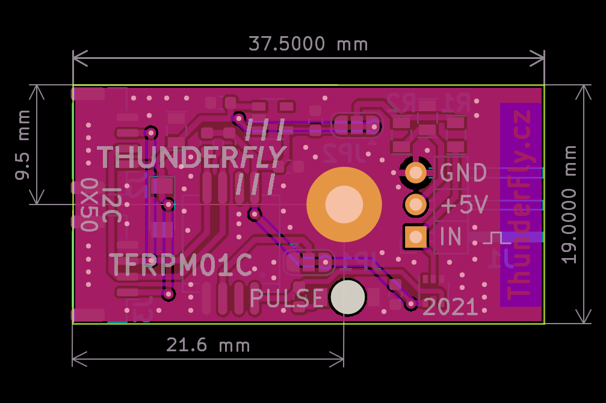

# TFRPM01C - RPM measuring device

Revolutions per minute measurement device for UAV.
It is designed to direct connection to the Pixhawk controller (CUAV V5+ for example) through a standard I²C connector. The device [is supported by PX4 firmware](https://docs.px4.io/master/en/sensor/thunderfly_tachometer.html).
The input of the meter is supposed a pulse signal from an optical encoder, hall sensor, etc. The pulses are counted during a predefined constant interval. 
The hardware is intended to be used for helicopter and autogyro rotor RPM measurement, but its counting capability is up to 20 kHz therefore it should be used for propeller or engine RPM measurement.

## Where to get it?

ThunderFly RPM counter is commercially available from [ThunderFly s.r.o.](https://www.thunderfly.cz/), write an email to info@thunderfly.cz or shop at [Tindie store](https://www.tindie.com/products/thunderfly/tfrpm01-drone-rpm-tachometer-sensor/).

## Parameters

| Parameter | Value | Description |
|-----------|-------|-------------|
| Pulse frequency range | 0 - 20 kHz (equal high and low periods) | Maximum RPM value varies by pulse number per revolution |
| I2C Connector | 2x 4-pin JST-GH | Connected in parallel |
| RPM connector | 3-pin 2.54mm pitch header | Internal 22k Ohm pullup resistor |
| I2C adress | 0x50 default | By switching JP1 possible change to 0x51 |
| I2C SCL clock frequency | Max 100 kHz | Operation on 400 kHz is possible, but unreliable|
| Operating and storage temperature | −20°C to +40°C | Limited by case material |
| Operational input voltage | +3.6V to +5.4V | Overvoltage internally protected by zener diode, undervoltage is not treated |
| Mass | 4g PCB + 8g case | Printed case gcode included in docs |
| Dimensions | 23.5x42x12.5mm / 37.5x19mm | Case / PCB |
| Weather resistance | [IP40](https://en.wikipedia.org/wiki/IP_Code) | External connectors fully occupied |

## Features

  * Short circuit protection on probe connector
  * Input status LED indicator - [optionally visible at daylight](/doc/README.md)
  * Pass-trough I²C connectors to allow daisy chain of different sensors
  * Offload flight controller's MCU, by storing the number of counted pulses in internal memory

The 3Pin probe connector is powered from I²C bus trough RC filter which limits current and voltage spikes to sensor probe.
Therefore sensor is resistant to short circuit at the probe connector power.

The two I²C Pixhawk connectors are connected to each other. This feature allows easily nesting with other I²C devices to single Pixhawks I²C port.

## Connection to the Pixhawk autopilot

The I²C interface connectors respects the [Pixhawk connector standard](https://github.com/pixhawk/Pixhawk-Standards/blob/master/DS-009%20Pixhawk%20Connector%20Standard.pdf). The signal and color coding of the connector and supplied cable are described by following table (ThunderFly color scheme):

|Signal | Pixhawk Color | ThunderFly color |
|--------|------------------|---------------------|
| +5V    | Red |  Red |
| SCL  | Black |   Yellow  |
| SDA  | Black |   Green |
| GND | Black  |  Black |

The conductor colors in the cable are different to Pixhawk standard to increase the visual distinction between multiple cables in the UAV.

### Cable turnig

To improve I2C bus reliability, the supplied cable is specifically turned by following scheme

- 10 turns for each pair SCL/+5V and SDA/GND per 30cm cable length
- The two pairs are turned again by 4 turns of pairs per 30cm cable length.

This special cable conductors winding method, greatly improves the signal integrity by minimising of the crosstalk between the SDA and SCL signals.

### I²C Address configuration

By default the TFRPM01C sensor is manufactured with 0x50 I²C address. This address is possible to change to 0x51 by altering the JP1 solder junction. The junction connection to GND needs to be cut by knife and then soldered to opposite side Vcc.

The default configuration of the junction corresponds to following picture, where center pin is connected to GND by copper trace.

## Mounting options

The device is designed to be mouted with or without plastic case. The 3D printed case is intended to be modifable to particular sensor mount options. The supplied variant of 3D printed case supports two mount options:

  * By default the case could be mounted by screw on flat sulface (the original screew need to be replaced by longer one)
  * The second option is use of [double sided adhesive tape](https://www.3m.com/3M/en_US/vhb-tapes-us/) or [reclosable fastener](https://www.3m.com/3M/en_US/dual-lock-reclosable-fasteners-us/) sticked on the side of the TFRPM01 case.

### PCB dimensions

The PCB is designed to be mounted on flat surface by center screw hole. The supposed screw diameter is metric 3mm e.g. DIN 912 M3 Hexagon socket Head Cap Screws.

### Sensor probe selection

The counter could be used with multiple types of sensor probes. The most used one is a hall effect probe.  The magnetic probe is ideal for harsh environments, where dirt, dust, and water can contact the sensed rotor. Disadvantage is, that mounting of magnet is required for proper sensor work. 

The probe should be connected to the sensor board as follows (- Black, + Red, Pulse Blue)

Correct connection of the probe could be check by magnet, the PULSE LED switch on and off according to magnet presence. The sensor board needs to be powered from at least one I²C port during the test.

The sensor could also be used with other probe types. We tested the se [TFPROBE01](https://github.com/ThunderFly-aerospace/TFPROBE01), which combines the optical reflective sensor and magnetic hall-effect sensor in one device. 

Technically TFRPM01 could be used by every probe with pulsed output with amplitude in range of 0 to +5V. However the TFRPM01 sensor needs matching the input parameters to certain probe types. The default configuration is reflected in the following schematics.

As can be seen from the schematics the default probe power selection is +5V, protected by resistor R2 to about 61 mA short-circuit current. The pull-up resistor R1 with default value 22 kOhm is quite hard and it is generally unsuitable to most optical probes with open-collector outputs. Therefore the resistor R1 should be interchanged to a more suitable (usually increased) value. It is depending on the selected material for the optical sensor this value might need further fine-tuning. (The specific resistor value could be requested during the order process in case of ordering a larger quantity).

## Software configuration

The TFRPM01 revolution counter is currently supported by PX4 firmware only. (Ardupilot pull-requests are welcomed)
After proper connection of the sensor with sensing probe to an I2C port (Except port I2C3) of PX4 based autopilot you should follow instructions to [PX4 software setup](https://docs.px4.io/main/en/sensor/thunderfly_tachometer.html#software-setup). After proper setup, you should get an uLog containing the RPM logged during the flight. Here is an example of rotor RPM captured during the flight of [TF-G2 autogyro](https://github.com/ThunderFly-aerospace/TF-G2). The graph is rendered by [flight_review](https://github.com/ThunderFly-aerospace/flight_review).

# FAQ
## What about the measurement resolution of the RPM? 

RPM measurement [resolution](https://en.wikipedia.org/wiki/Sensor#Resolution) depends on [pooling interval](https://docs.px4.io/main/en/advanced_config/parameter_reference.html#PCF8583_POOL) and the number of pulses per revolution. 

RPM is calculated from measured values (pulses per interval) as follows

Therefore the resolution of measured RPM is following:

Where:
  * N is pulses per revolution
  * τ is the pooling interval in seconds
  * Nc is pules counted during the measurement pooling interval
  * Res is the absolute resolution of measurement in +/- RPM 

Therefore the absolute resolution of the sensor is independent of the current RPM measured and remains constant depending on sensor configuration, however, relative resolution increases with the RPM measured.  The absolute resolution strongly depends on the length of the pooling interval (a longer interval gets better resolution). The resolution also increases with the number of pulses per revolution, where more pulses per revolution give better RPM resolution. Related terms like precision and accuracy are more difficult to analyze because depend on hardware and firmware versions of Pixhawk, but these errors could be neglected in the usual use cases.

## Does it connect to RPM output from ESC? 

Generally yes, the TFRPM could be connected to revolution output from an ESC in case of output logic confirms to 5V TTL.

