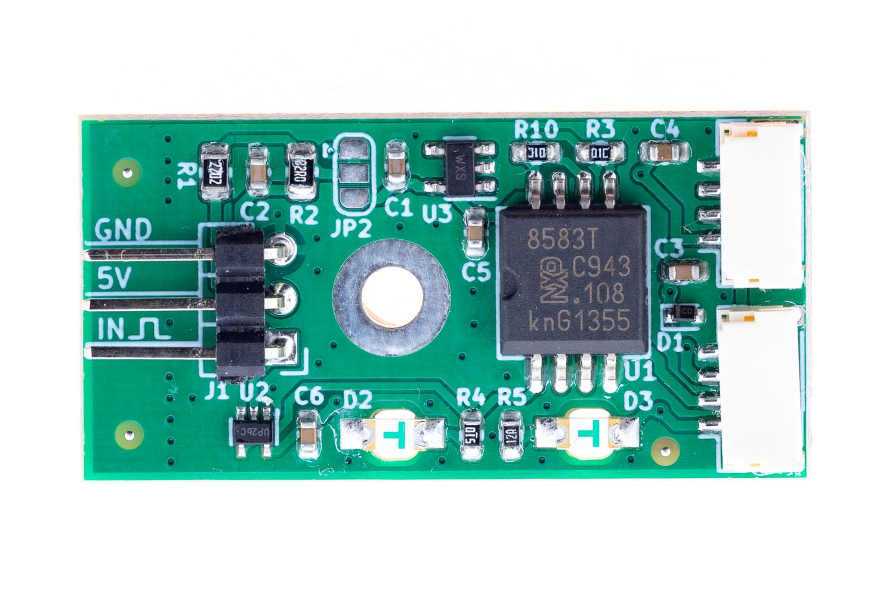
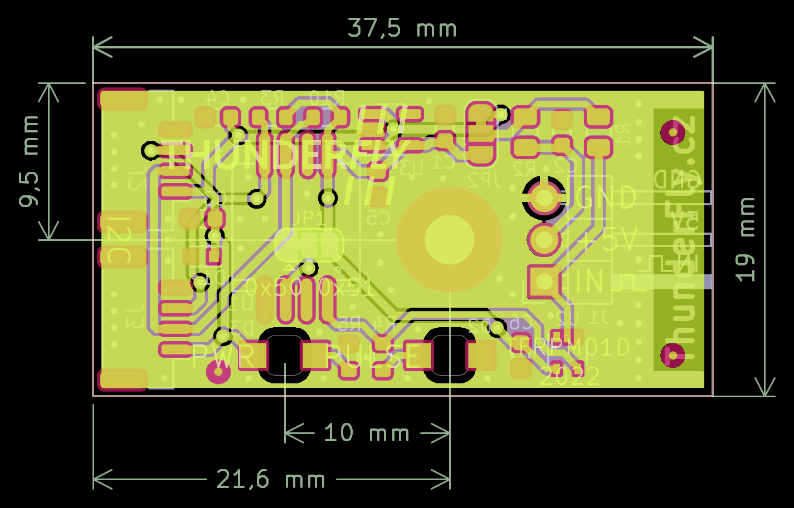

# TFRPM01 - RPM Measuring Device

## Overview
The TFRPM is a device designed for measuring revolutions per minute (RPM) in UAVs. It connects directly to Pixhawk controllers like CUAV V5+ via a standard I²C connector and is compatible with PX4 firmware.

## Specifications

### Features
- **Schmitt Trigger Input**: To shape non-uniform signals from RPM sensing elements.
- **Self-Counting and Memory**: Offloads the flight controller's MCU.
- **LED Indicator**: For input status, optionally visible in daylight.
- **Protection**: Short circuit protection on the probe connector.
- **I²C Connectors**: Pass-through connectors for daisy-chaining sensors.
- **Design**: Robust and repairable.

### Technical Parameters
- **Pulse Frequency Range**: 0 - 20 kHz.
- **I2C Connector**: 2x 4-pin JST-GH.
- **RPM Connector**: 3-pin 2.54mm pitch header.
- **I2C Address**: 0x50 default, alterable to 0x51.
- **Operating Temperature**: −20°C to +40°C.
- **Input Voltage**: +3.6V to +5.4V.
- **Mass**: 12g (4g PCB + 8g case).
- **Dimensions**: Case - 23.5x42x12.5mm, PCB - 37.5x19mm.
- **Weather Resistance**: IP40.

### Where to Get It?
TFRPM can be bought directly from ThunderFly via [email contact](https://www.thunderfly.cz/contact-us.html). The email can also be used if there are specific requirements for custom modifications or if the product will be inquired in significant quantities. TFRPM is also available for online purchase through the [Tindie store](https://www.tindie.com/products/thunderfly/tfrpm01-drone-rpm-tachometer-sensor/).

### Connection to Pixhawk Autopilot
Follows the [Pixhawk connector standard](https://github.com/pixhawk/Pixhawk-Standards/blob/master/DS-009%20Pixhawk%20Connector%20Standard.pdf) with specific color coding.

### I²C Address Configuration
The default address is 0x50, changeable to 0x51.

### Mounting Options
The device can be mounted with or without a provided 3D-printed case.

### Sensor Probe Selection

Compatible with multiple probe types, including Hall effect and optical probes. See the [TFPROBE01](https://github.com/ThunderFly-aerospace/TFPROBE01) and [TFRPM01 documentation](https://docs.thunderfly.cz/avionics/TFRPM01/) for details.

Thirdparty hall probe sensor could be also used, here is example of suitable generic hall probe with mounting fladge.

## Software Configuration

Supported by PX4 firmware. Setup instructions are available on the [PX4 documentation](https://docs.px4.io/main/en/sensor/thunderfly_tachometer.html#software-setup).

