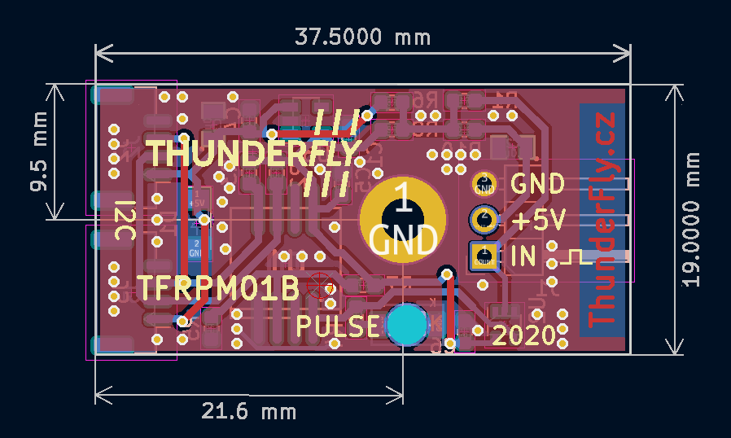

# TFRPM01C - RPM measuring device 

Revolutions per minute meter for UAV.
It is designed to direct connection to Pixhawk controller (CUAV V5+) trough standard I²C connector. The device [is supported by PX4 firmware](https://docs.px4.io/master/en/sensor/thunderfly_tachometer.html).
At the input of meter is supposed a pulse signal from optical encoder, hall sensor etc.
The hardware is inteded to be used for helicopter and autogyro rotor RPM measurement, but its counting capability is up to 20 kHz therefore it should be used for propeller or engine RPM measurement.

## Where to get it?

ThunderFly RPM counter is commercially available from [ThunderFly s.r.o.](https://www.thunderfly.cz/), write an email to info@thunderfly.cz or shop at [Tindie store](https://www.tindie.com/products/thunderfly/tfrpm01-drone-rpm-tachometer-sensor/).

## Parameters

| Parameter | Value | Description |
|-----------|-------|-------------|
| Pulse frequency range | 0 - 20 kHz | Maximum RPM value varies by pulse number per revolution |
| I2C Connector | 2x 4-pin JST-GH | Connected in parallel |
| RPM connector | 3-pin header | internal pullup resistor | 
| Operating and storage temperature | -20 - +40°C | Limited by case material | 
| Operational input voltage | 3.6 - 5V ||
| Mass | 4 g + 8 g | PCB + case |
| Dimensions | 23.5x42x12.5mm / 37.5x19mm | Case / PCB |
| Short circuit protection on probe connector | | |

The 3Pin probe connector is powered from I²C bus trough RC filter which limits current and voltage spikes to sensor probe.
Therefore sensor is resistant to short circuit at the probe connector power.

The two I²C Pixhawk connectors are connected to each other. This feature allows easily nesting with other I²C devices to single Pixhawks I²C port.

PCB size:

### Sensor options

The sensor could be used with multiple sensor probes. The most used one is a hall effect probe.

The probe should be connected to the sensor board as follows

Correct connection of the probe could be check by magnet, the PULSE LED switch on and off according to magnet presence. The sensor board needs to be powered from at least one I²C port during the test.

The sensor could also be used with other probe types. The one example is [TFPROBE01](https://github.com/ThunderFly-aerospace/TFPROBE01), which combines the optical reflective sensor and magnetic hall-effect sensor in one device. However the TFRPM01 sensor needs matching the input parameters to certain probe types. The default configuration is reflected in the following schematics.

As can be seen from the schematics the default probe power selection is +5V, protected by resistor R10 to about 50 mA short-circuit current. The pull-up resistor R1 with default value 470 Ohm is quite hard and it is generally unsuitable to most optical probes with open-collector outputs. Therefore the resistor R1 should be interchanged to the more suitable value (That could be requested during the order process).
