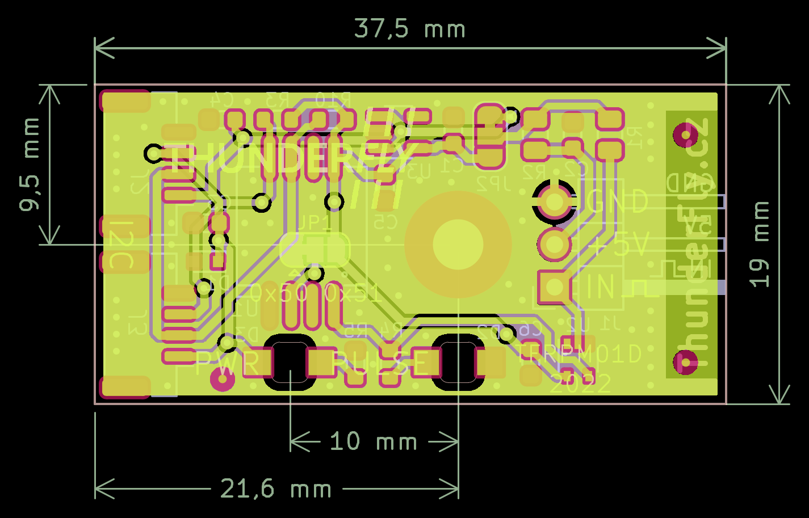

# TFRPM01D - Zařízení pro měření otáček

Zařízení pro měření otáček za minutu (RPM) pro bezpilotní letouny (UAV).
Je navrženo pro přímé připojení k řadiči Pixhawk (například CUAV V5+) prostřednictvím standardního I²C konektoru. Zařízení [je podporováno firmwarem PX4](https://docs.px4.io/master/en/sensor/thunderfly_tachometer.html).
Vstupem měřiče je pulzní signál z optického enkodéru, hallového senzoru atd. Pulzy se počítají během předem definovaného konstantního intervalu.
Hardware je určen k použití pro měření otáček rotoru vrtulníků a vírníků, ale je schopný měřit až do 20 kHz, takže by měl být použitelný i pro měření otáček vrtule nebo motoru.

## Kde jej získat?

RPM čítač ThunderFly je komerčně dostupný od [ThunderFly s.r.o.](https://www.thunderfly.cz/), napište e-mail na info@thunderfly.cz nebo kupte online v [obchodě Tindie](https://www.tindie.com/products/thunderfly/tfrpm01-drone-rpm-tachometer-sensor/).

## Hlavní funkce

  * Snížení využití letového MCU, vlastním počítáním počtu detekovaných pulzů do interní paměti přístupné přes I²C
  * Indikátor stavu vstupu LED - [dobře viditelný ve dne](/doc/README.md) pro snadné ladění mechanické konfigurace
  * Ochrana proti zkratu na konektoru sondy
  * Průchozí I²C konektory pro umožnění zapojení dalších nebo více senzorů

## Parametry

| Parametr | Hodnota | Popis |
|----------|---------|-------|
| Rozsah frekvence pulzů | 0 - 20 kHz | Maximální hodnota RPM se liší podle počtu pulzů na otáčku |
| I2C konektor | 2x 4-pin JST-GH | Připojeny paralelně |
| RPM konektor | 3-pin 2.54mm rozteč pinů | Interní 22k Ohm pullup rezistor |
| I2C adresa | 0x50 výchozí | Přepnutím JP1 možná změna na 0x51 |
| Frekvence hodin I2C SCL | Max 100 kHz | Provoz na 400 kHz je možný, ale nespolehlivý |
| Provozní a skladovací teplota | −20°C do +40°C | Omezeno materiálem pouzdra |
| Provozní vstupní napětí | +3.6V do +5.4V | Přepětí interně chráněno Zenerovou diodou, podpětí není řešeno |
| Hmotnost | 4g DPS + 8g krabička | Tiskový soubor krabičky je zahrnut v dokumentaci |
| Rozměry | 23.5x42x12.5mm / 37.5x19mm | Pouzdro / DPS |
| Odolnost proti povětrnostním vlivům | [IP40](https://cs.wikipedia.org/wiki/IP_k%C3%B3d) | Externí konektory plně osazené |

3-Pinový konektor sondy je napájen z I²C sběrnice přes RC filtr, který omezuje proud a napěťové špičky na sondě.
Proto je senzor odolný vůči zkratům na konektoru sondy.

Dva I²C konektory Pixhawk jsou navzájem propojeny. Tato funkce umožňuje snadné spojení s dalšími I²C zařízeními na jednom portu I²C Pixhawk.

## Připojení k autopilotu Pixhawk

Konektory rozhraní I²C respektují [standard konektorů Pixhawk](https://github.com/pixhawk/Pixhawk-Standards/blob/master/DS-009%20Pixhawk%20Connector%20Standard.pdf). Signál a barevné kódování konektoru a dodaného kabelu jsou popsány následující tabulkou (barevné schéma ThunderFly):

| Signál | Barva Pixhawk | Barva ThunderFly |
|--------|--------------|------------------|
| +5V    | Červená |  Červená |
| SCL    | Černá   |  Žlutá  |
| SDA    | Černá   |  Zelená |
| GND    | Černá   |  Černá |

Barvy vodičů v kabelu se liší od standardu Pixhawk, aby se zvýšila vizuální odlišnost mezi více kabely v UAV.

### Otočení kabelu

Pro zlepšení spolehlivosti sběrnice I2C je dodaný kabel specificky smotán podle schématu

- 10 závitů pro každý pár SCL/+5V a SDA/GND na 30 cm délky kabelu
- Oba páry jsou znovu otočeny 4 závity párů na 30 cm délky kabelu.

Tato speciální metoda vinutí vodičů kabelu výrazně zlepšuje integritu signálu tím, že minimalizuje přeslechy mezi signály SDA a SCL.

### Konfigurace I²C adresy

Ve výchozím nastavení je senzor TFRPM01C vyroben s adresou I²C 0x50. Tuto adresu je možné změnit na 0x51 změnou spojovacího bodu JP1. Spojení s GND je třeba přerušit nožem a poté připájet na opačnou stranu Vcc.

Výchozí konfigurace spojovacího bodu odpovídá následujícímu obrázku, kde je středový pin je spojen se zemní ploškou (GND).

## Možnosti montáže

Zařízení je navrženo tak, aby jej bylo možné montovat s nebo bez plastové krabičky. 3D tištěná krabicka je navržena tak, aby ji bylo možné upravit pro konkrétní možnosti a potřeby montáže senzoru. Dodaná varianta 3D tištěného pouzdra podporuje dvě možnosti montáže:

  * Ve výchozím nastavení lze pouzdro připevnit šroubem na rovný povrch (původní šroub je třeba nahradit delším)
  * Druhou možností je použití [dvoustranné lepicí pásky](https://www.3m.com/3M/en_US/vhb-tapes-us/) nebo [uzavíratelného upevňovacího prvku](https://www.3m.com/3M/en_US/dual-lock-reclosable-fasteners-us/) nalepeného na stranu pouzdra TFRPM01.

### Rozměry DPS

DPS je navržena tak, aby byla možná montáž na rovný povrch pomocí středového otvoru pro šroub. Předpokládaný průměr šroubu je metrický 3 mm, např. DIN 912 M3 šroub s vnitřním šestihranným otvorem.

### Výběr sondy senzoru

Čítač lze použít s více typy sond senzorů. Nejpoužívanější je hallová sonda. Magnetická sonda je ideální pro náročné prostředí, kde mohou prach, nečistoty a voda přijít do kontaktu s cítěným rotorem. Nevýhodou je, že je třeba namontovat magnet pro správnou funkci senzoru.

Sonda by měla být připojena k desce senzoru následovně (- Černá, + Červená, Pulz Modrá)

Správné připojení sondy lze ověřit magnetem, a LED dioda PULSE se zapne a vypne podle přítomnosti magnetu. Deska senzoru musí být napájena alespoň z jednoho portu I²C během testu.

Senzor lze také použít s jinými typy sond. Testovali jsme se [TFPROBE01](https://github.com/ThunderFly-aerospace/TFPROBE01), který kombinuje optický reflexní senzor a magnetický hallový senzor v jednom zařízení.

Technicky by TFRPM01 mohl být použit s každou sondou s pulzním výstupem s amplitudou v rozmezí 0 až +5 V. Výchozí konfigurace je znázorněna na následujícím schématu.

Jak je vidět ze schématu, výchozí výběr napájení sondy je +5 V, chráněný rezistorem R2 na přibližně 61 mA zkratový proud. Pull-up rezistor R1 s výchozí hodnotou 22 kOhm je poměrně tvrdý a je obecně nevhodný pro většinu optických sond s otevřenými kolektory. Proto by měl být rezistor R1 vyměněn za vhodnější (obvykle zvýšenou) hodnotu. Závisí na zvoleném materiálu pro optický senzor, tato hodnota může potřebovat další jemné doladění. (Konkrétní hodnotu rezistoru lze požadovat během procesu objednávání v případě objednání většího množství).

## Konfigurace softwaru

Čítač otáček TFRPM01 je v současné době podporován pouze firmwarou PX4. (Pull requesty pro Ardupilot jsou vítány)
Po správném připojení senzoru se sondou k portu I2C (kromě portu I2C3) autopilota na bázi PX4 byste měli postupovat podle pokynů k [nastavení softwaru PX4](https://docs.px4.io/main/en/sensor/thunderfly_tachometer.html#software-setup). Po správném nastavení byste měli získat uLog obsahující RPM zaznamenané během letu. Zde je příklad otáček rotoru zachycených během letu [autogyra TF-G2](https://github.com/ThunderFly-aerospace/TF-G2). Graf je vykreslen pomocí [flight_review](https://github.com/ThunderFly-aerospace/flight_review).

# FAQ
## Jaká je rozlišovací schopnost měření RPM?

Rozlišovací schopnost měření RPM [rozlišení](https://cs.wikipedia.org/wiki/Senzor#Rozli%C5%A1ovac%C3%AD_schopnost) závisí na [intervalu vyčítání](https://docs.px4.io/main/en/advanced_config/parameter_reference.html#PCF8583_POOL) a počtu pulzů na otáčku.

RPM se vypočítává z naměřených hodnot (pulzy za interval) následovně

Proto je rozlišovací schopnost měřených RPM následující:

Kde:
  * N je pulzy na otáčku
  * τ je interval vyčítání v sekundách
  * Nc je pulzy spočítané během měřicího intervalu vyčítání
  * Res je absolutní rozlišovací schopnost měření v +/- RPM

Proto absolutní rozlišovací schopnost senzoru je nezávislá na aktuálně měřených RPM a zůstává konstantní v závislosti na konfiguraci senzoru, avšak relativní rozlišovací schopnost se zvyšuje s měřenými RPM. Absolutní rozlišovací schopnost silně závisí na délce intervalu vyčítání (delší interval poskytuje lepší rozlišení). Rozlišovací schopnost také roste s počtem pulzů na otáčku, kde více pulzů na otáčku poskytuje lepší rozlišení RPM. Související termíny jako přesnost a přesnost jsou obtížnější k analýze, protože závisí na hardwarových a softwarových verzích Pixhawk, ale tyto chyby by mohly být zanedbány v běžných případech použití.

## Lze jej připojit k výstupu RPM z ESC?

Obecně ano, TFRPM by mohl být připojen k výstupu otáček z ESC v případě, že logika výstupu potvrzuje 5V TTL.
Omezením je zde rozlišovací schopnost RPM, protože mnoho ESC získává jeden pulz na otáčku. Viz výše uvedený vzorec pro vysvětlení.

## Lze použít pro spalovací motory?

Ano, mohl by měřit otáčky spalovacího motoru. Nicméně potřebuje pulzní signál k počítání rychlosti otáčení. Pulsed signál by mohl být získán buď z [elektronické řídící jednotky](https://cs.wikipedia.org/wiki/Elektronick%C3%A1_%C5%99%C3%ADd%C3%ADc%C3%AD_jednotka) (ECU) nebo z [optické nebo magnetické sondy](https://github.com/ThunderFly-aerospace/TFPROBE01) namontované na vhodném místě motorové jednotky. Přímé připojení TFRPM k zapalování nebo cítícím cívkám není možné bez úpravy signálu, protože napětí signálů přicházejících z cívek pravděpodobně zničí TTL-based vstup RPM TFRPM. Požadovaná úprava signálu by mohla být realizována sítí rezistorů v mnoha případech. Kontaktujte [ThunderFly s.r.o.](https://www.thunderfly.cz/contact-us.html) v případě, že potřebujete profesionální podporu.
